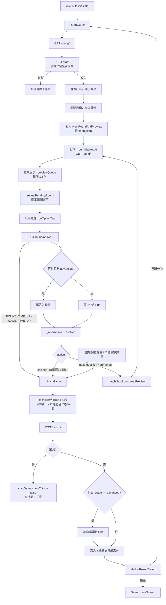

# 料理準備（cooking_prep）系統說明

> 這份文件描述 `lib/features/game/cooking_prep/` **目前程式碼實際的運作方式**：
> 檔案分工、狀態、完整遊戲流程、每個函式做什麼、計時與暫停、結算，以及目前
> 已知的問題。API 欄位的實測細節與歷史 bug 演進請看
> [`cooking_prep_frontend_spec.md`](./cooking_prep_frontend_spec.md)。
>
> 最後更新：2026-10-05（`fix/session` 分支）。已對照後端 `games/memory_recall/views.py`
> 更正：前測由後端決定、正式賽單題作答時限、時間到是錯誤碼不是 action。

---

## 目錄

1. [一句話說明](#1-一句話說明)
2. [檔案結構與分工](#2-檔案結構與分工)
3. [遊戲規則（1-back 記憶鏈）](#3-遊戲規則1-back-記憶鏈)
4. [三個階段](#4-三個階段)
5. [後端 API 與資料模型](#5-後端-api-與資料模型)
6. [頁面狀態欄位](#6-頁面狀態欄位)
7. [完整遊戲流程](#7-完整遊戲流程)
8. [畫面渲染優先順序](#8-畫面渲染優先順序)
9. [計時、暫停與恢復](#9-計時暫停與恢復)
10. [結算與歷史成績](#10-結算與歷史成績)
11. [前測 vs 正式賽](#11-前測-vs-正式賽)
12. [錯誤處理](#12-錯誤處理)
13. [本機儲存（SharedPreferences）](#13-本機儲存sharedpreferences)
14. [前端自訂常數](#14-前端自訂常數)
15. [已知問題與待辦](#15-已知問題與待辦)
16. [除錯指引](#16-除錯指引)

---

## 1. 一句話說明

「料理準備」是後端 `memory_recall`（記憶配對）遊戲的**美術主題包裝**：題目、
正解、升階、計時、計分全部由後端決定，前端只負責「展示物品 → 顯示兩個選項
→ 送出玩家的選擇 → 依後端回傳的 `action` 決定下一步」，外加切菜／調味／烹飪
三種場景的動畫。

---

## 2. 檔案結構與分工

```
lib/features/game/cooking_prep/
├── pages/
│   └── cooking_prep_game_page.dart      # 唯一的頁面，整個遊戲流程都在這裡
├── services/
│   └── memory_recall_service.dart       # 6 支 API（含 JWT Authorization header）
├── models/
│   ├── memory_recall_model.dart         # API 回應的資料結構
│   ├── cooking_prep_model.dart          # stage 字串 → 中文標題（切菜/調味/烹飪）
│   └── cooking_prep_asset_map.dart      # 物品字串 → 圖片路徑、場景道具圖
└── widgets/
    ├── cooking_prep_background.dart     # 上灰下綠的背景（三階段共用）
    ├── cooking_prep_tutorial_dialog.dart# 玩法教學（全螢幕 3 頁 PageView）
    ├── memory_recall_option_cards.dart  # 「請問上一個是什麼」二選一卡片
    ├── chopping_display_scene.dart      # 切菜：展示物品（砧板＋食材＋刀，靜態）
    ├── chopping_reward_scene.dart       # 切菜：答對動畫（刀滑過、食材變切好）
    ├── seasoning_pour_scene.dart        # 調味：展示物品（鍋子＋調味料罐）
    ├── seasoning_soup_reward_scene.dart # 調味：答對動畫（完整湯圖淡入）
    └── cooking_pot_scene.dart           # 烹飪：展示物品（鍋子＋食材）
```

外部依賴：

| 依賴 | 用途 |
|---|---|
| `market_shopping/widgets/game_in_progress_top_bar.dart` | 頂部標題列（暫停、通知按鈕） |
| `widgets/game_pause.dart` | 暫停選單（繼續／教學／重新開始／退出） |
| `go_to_market/widgets/market_result_dialog.dart` | 結算對話框（本次、最高分、歷史） |
| `core/services/audio_service.dart` | 音效 |
| `core/services/token_storage.dart` | 取得 JWT access token |
| `core/network/api_response.dart` | `parseEnvelope` 統一解析 `{success, data, error}` |
| `core/constants/api_constants.dart` | `serverUrl` |

入口：`lib/screens/game_home_screen.dart` 直接 push `CookingPrepGamePage()`。
頁面在 `initState` 鎖橫向、`dispose` 恢復直向（`main.dart` 啟動時也會強制直向）。

---

## 3. 遊戲規則（1-back 記憶鏈）

後端維護一條物品序列 `P(0), P(1), P(2), ...`，`P(0)` 就是 `start/` 回傳的
`seed_item`。

| 輪次 | 畫面先展示（「請記住這個」） | 接著出現的兩個選項 | 正解 |
|---|---|---|---|
| 第 1 輪 | `seed_item`（P0）→ 第 1 輪的 `new_item`（P1），**共 2 個** | 第 1 輪的 `option_items` | P0 |
| 第 2 輪 | 第 2 輪的 `new_item`（P2），**1 個** | 第 2 輪的 `option_items` | P1 |
| 第 N 輪 | 第 N 輪的 `new_item`（PN），**1 個** | 第 N 輪的 `option_items` | P(N-1) |

重點：

- 每一輪展示的 `new_item` **保證不在這一輪自己的選項裡**，它是「下一輪」的
  答案。這一輪的正解是上一輪展示過的物品，玩家要靠記憶選出來。
- 選項卡頂部文字是「**請問上一個是什麼**」。
- 前端**不知道哪張是正解**，只送出 `selected_item`，對錯完全看後端回的
  `is_correct`。因此只會在「被選中的那張」畫勾或叉。
- 答錯不重試，鏈照樣往下走。
- 升階**不會**重新給 seed，也不會多展示一個物品：整場只有第 1 輪展示 2 個。
- `option_items` 陣列順序是隨機的，前端還會再 `shuffle()` 一次決定左右位置。

> 舊版（ver5）曾用「比較 stage、換階段展示 2 個物品」的邏輯，**已經不用了**。
> 以本文件與 `cooking_prep_game_page.dart` 類別註解（ver6）為準。

---

## 4. 三個階段

| 後端 `stage` | 標題 | 展示場景 | 答對回饋 | 物品字串 |
|---|---|---|---|---|
| `basic` | 切菜 | `ChoppingDisplayScene` | `ChoppingRewardScene`（刀滑過 600ms，食材換成切好的圖）＋切菜音效 | 馬鈴薯／胡蘿蔔／洋蔥 |
| `intermediate` | 調味 | `SeasoningPourScene` | `SeasoningSoupRewardScene`（湯圖淡入 900ms） | 辣椒粉／鮮奶油／咖哩塊 |
| `advanced` | 烹飪 | `CookingPotScene` | **沒有動畫**，停 1 秒直接下一輪 | 馬鈴薯塊/泥、紅蘿蔔塊/片、洋蔥圈/絲 |

- 頂部標題：`料理準備・${stage.cookingStageTitle}`。
- **畫面主題用 `round/` 回傳的 `stage`**，不用 `round/answer/` 的
  `current_stage`。原因是升階當下 `current_stage` 就變了，但後端下一次
  `round/` 還會先給一輪舊階段的題（「橋接輪」），畫面要跟實際物品對齊。
- 圖片對照在 `kMemoryRecallItemImages`，**key 必須是後端實際回傳的字串**。
  對不到時 `imagePathForMemoryRecallItem` 回空字串，畫面顯示 Icon 佔位。
- advanced 卡片的干擾物可能來自任何階段，不要寫「同組才顯示」的篩選。
- 整場結束時若 `final_stage == 'advanced'`，會先播 1.8 秒咖哩飯彩蛋
  （「恭喜完成烹飪關卡！」）再進結算。

---

## 5. 後端 API 與資料模型

Base URL：`${ApiConstants.serverUrl}/api/games/memory-recall`
所有請求都帶 `Authorization: Bearer <token>`；拿不到 token 會丟
`Exception('尚未登入，找不到token')`。

| # | 方法 | 路徑 | Service 方法 | 回傳 Model | 頁面在哪裡呼叫 |
|---|---|---|---|---|---|
| 1 | GET | `/config/` | `fetchConfig()` | `MemoryRecallConfig` | `_startGame` |
| 2 | POST | `/start/` | `startGame({isPretest})` | `MemoryRecallSession` | `_startGame` |
| 3 | GET | `/round/?session_id=` | `fetchRound({sessionId})` | `MemoryRecallRound` | `_fetchNextRoundAndPreview` |
| 4 | POST | `/round/answer/` | `submitAnswer({...})` | `MemoryRecallAnswerResult` | `_onOptionTap` |
| 5 | POST | `/finish/` | `finishGame({sessionId})` | `MemoryRecallResult` | `_finishGame` |
| 6 | GET | `/result/{session_id}/` | `fetchResult({sessionId})` | `MemoryRecallResult` | **目前沒有使用** |

### 5.1 Model 欄位

**`MemoryRecallConfig`**：`isPretest`（**後端永遠回 false**，不能拿來判斷前測）、
`currentStage`、`pretestTotalRounds`、`baseTimeLimitSeconds`、`promoteStreak`
（前端未使用）、`promoteBonusSeconds`。後端另外回了 `stage_item_pools`，前端
model 沒有這個欄位。

**`MemoryRecallSession`**（`start/`）

| 欄位 | 型別 | 說明 |
|---|---|---|
| `sessionId` | `String` | 後端是 UUID 字串；用 `data['session_id'].toString()` 解析 |
| `isPretest` | `bool` | **前測與否以這個為準**（後端依資料庫判斷，見 §11） |
| `currentStage` | `String` | |
| `expiresAt` | `DateTime?` | **前測沒有**，所以前測不倒數 |
| `seedItem` | `String?` | P(0)，整場只有這裡拿得到 |

**`MemoryRecallRound`**（`round/`）：`roundNumber`、`stage`、`optionItems`（2 個）、
`newItem`（這一輪要記住、下一輪才用到）

**`MemoryRecallAnswerResult`**（`round/answer/`）：`isCorrect`、`action`、
`currentStage`、`correctStreak`、`bonusSecondsGranted`（只有 promoted 時 > 0）、
`expiresAt`（升階會延長）、`scoreEarned`

`action` 可能值：

| action | 什麼時候 | 前端行為 |
|---|---|---|
| `next_question` | 其他情況 | 抓下一輪 |
| `promoted` | 正式賽連對 6 題升階 | 顯示 SnackBar「太棒了！進入「X」關卡，時間 +N 秒」，抓下一輪 |
| `finished` | **只有前測第 4 題** | `_finishGame()` → 直接開正式賽（見 §11） |

後端**不會**回 `action: "time_up"`，正式賽也不會回 `finished`。正式賽時間到、
單題超時都是以**錯誤碼**回傳（見 §12）。前端 `_afterAnswerResolved` 仍保留
`time_up` 判斷當防呆。

**`MemoryRecallResult`**（`finish/`、`result/`）：`totalRounds`、`totalCorrect`、
`totalWrong`、`accuracy`（0～1）、`avgResponseTimeMs`、`finalStage`、
`totalBonusSeconds`、`totalScore`（**前測是 null**）。

- `finish/` 的欄位直接在 `data` 底下；`result/` 外面多包一層
  `data.session_result`。兩者分別用 `fromJson`／`fromResultJson` 解析，
  已經處理好了。
- `finish/` 重複呼叫會回傳同一份結果。
- `finish/` 另外有回 `score`（0～100 的跨遊戲統一分數），前端目前沒有使用，
  歷史成績用的是正確率 %。

---

## 6. 頁面狀態欄位

`_CookingPrepGamePageState` 的主要欄位，依用途分組：

**場次**

| 欄位 | 說明 |
|---|---|
| `_sessionId: String?` | 本場 session |
| `_isPretest` | 本場是否為前測（來自 `start/` 回應） |
| `_pretestTotalRounds` | 前測輪數，預設 4，`config/` 覆蓋 |
| `_currentStage` | 畫面主題用的 stage（跟著 `round.stage`） |

**輪次流程**

| 欄位 | 說明 |
|---|---|
| `_pendingRound` | 已抓到、但還在展示物品、尚未揭曉選項的那一輪 |
| `_currentRound` | 正在作答的那一輪（`null` 代表還沒開始，畫面顯示轉圈） |
| `_previewQueue` | 待展示的物品佇列（第 1 輪 2 個、其餘 1 個） |
| `_isShowingPreview` / `_previewItem` | 是否正在展示物品、展示哪一個 |
| `_optionOrder` | 打亂後的兩個選項 |
| `_questionShownAt` | 選項揭曉時間，用來算 `response_time_ms` |
| `_roundToken` | 每次 `fetchRound` +1，避免舊請求回來時蓋掉新狀態 |

**作答與回饋**

| 欄位 | 說明 |
|---|---|
| `_hasAnswered` / `_selectedItem` / `_lastAnswerCorrect` | 作答狀態，給選項卡畫勾叉 |
| `_isShowingReward` / `_pendingResult` | 答對動畫進行中、動畫結束後要處理的結果 |
| `_isCelebratingAdvanced` | 結束前的咖哩飯彩蛋 |

**計時**

| 欄位 | 說明 |
|---|---|
| `_expiresAt` | 後端給的結束時間（前測 null） |
| `_tickTimer` | 每 100ms 更新進度條 |
| `_timeProgress` | 進度條 0～1 |
| `_pausedAt` | 暫停時間點，恢復時用來補償 |
| `_baseTimeLimitSeconds` / `_promoteBonusSeconds` | 進度條總長估算（預設 60 / 15） |
| `_phaseController` | 物品展示計時用的 `AnimationController`（可 stop/forward 接續） |
| `_roundStartedAt` | 呼叫 `round/` 前記下的時間，單題倒數的起點（前測為 null） |
| `_roundProgress` | 單題倒數條 0～1 |

**其他**：`_isGameOver`（防止重複結算）、`_startErrorMessage`（開局錯誤畫面）、
`_endNotice`（結束前顯示的原因，例如「本題超過作答時間」）

---

## 7. 完整遊戲流程

### 7.1 總覽



### 7.2 開局 `_startGame()`

1. `setState` 重置所有上一場殘留狀態（回合、佇列、獎勵畫面、`_pausedAt`、作答
   狀態）。`_isShowingReward` 一定要清，否則「再玩一次」時 `_buildRewardWidget`
   會對 null 的 `_currentRound` 做 `!` 而崩潰。
2. 取消 `_tickTimer`。
3. `fetchConfig()`：失敗只印 log，用預設值繼續。
4. `startGame()`（**不帶** `is_pretest`，後端不讀）：失敗顯示錯誤畫面（含
   「重試」按鈕，直接再呼叫 `_startGame`）。
5. 存 `_sessionId`、`_isPretest`（來自回應）、`_currentStage`、`_expiresAt`。
6. 參數 `showTutorial`（預設 true）：
   - true：`_pauseTimers()` → `CookingPrepTutorialDialog.show()` →
     `_resumeTimers()`。教學期間前端倒數暫停，關掉後才開始。
   - false（前測結束直接接正式賽）：不顯示教學，有 `_expiresAt` 就直接
     `_startTicking()`。
7. `_fetchNextRoundAndPreview(initialAnchor: session.seedItem)`。

### 7.3 抓題 `_fetchNextRoundAndPreview({initialAnchor})`

1. `_isGameOver` 或沒有 session 就直接 return。
2. `isFirstRound = _currentRound == null`；`token = ++_roundToken`。
3. 正式賽記下 `_roundStartedAt = now`、`_roundProgress = 0`（**在呼叫
   `round/` 之前**，因為後端從收到 `round/` 就開始計單題時限）。
4. `fetchRound()`：
   - 失敗且是第 1 輪 → 錯誤畫面。
   - 失敗且非第 1 輪 → `_finishGame(endNotice: _endNoticeFor(e))`（例如
     `GAME_TIME_UP`、session 已結束）。
5. 回來後檢查 `mounted` 與 `token`，不一致就丟掉結果。
6. 組 `_previewQueue`：
   - 第 1 輪：`[seed_item, round.newItem]`（null 的項目自動略過；如果 seed_item
     不在 option_items 裡只印警告，照樣展示）。
   - 其他輪：`[round.newItem]`，沒有就空佇列。
7. `_pendingRound = round`、`_currentStage = round.stage`。
8. `_startPreviewQueue()`。

### 7.4 展示物品

- `_startPreviewQueue()`：佇列空 → 直接 `_revealPendingRound()`；否則在**同一個
  setState** 裡關掉 `_isShowingReward`、打開 `_isShowingPreview`，再讓
  `_phaseController` 從 0 跑 `kItemPreviewDisplayDuration`（1.5 秒）。
  合併在同一個 setState，是為了避免動畫結束和下一個展示之間閃回舊選項畫面。
- `_phaseController` 完成 → `_onPreviewDisplayDone()`：移除佇列第一個，還有就
  換 `_previewItem` 重跑，沒有就關掉展示、`_revealPendingRound()`。
- 展示畫面：依 `_currentStage` 選場景，下方是「請記住這個」膠囊標籤與隨時間
  縮短的進度條；用 `AnimatedSwitcher`（key = `_previewItem`）做淡入＋放大。
  場景高度由 `LayoutBuilder` 量出（`maxHeight - 110`，夾在 80～400），避免
  橫向螢幕溢出。

### 7.5 揭曉選項 `_revealPendingRound()`

把 `_pendingRound` 移到 `_currentRound`，`_optionOrder` 打亂，重置作答狀態，
記下 `_questionShownAt = now`。正式賽時選項卡上方會有單題倒數條（見 §9.2）。

### 7.6 作答 `_onOptionTap(item)`

1. 已作答或沒有題目就忽略；播 `normal.mp3`。
2. 算 `responseTimeMs = now - _questionShownAt`。
3. `setState`：`_hasAnswered = true`、`_selectedItem = item`。
4. `submitAnswer()`：失敗（`ROUND_TIME_UP`、`GAME_TIME_UP`、
   `SESSION_ALREADY_FINISHED` 等，後端都已經結束整場）→
   `_finishGame(endNotice: _endNoticeFor(e))`。
5. 更新 `_lastAnswerCorrect`；有新的 `expiresAt` 就覆蓋（升階加秒）。
6. 音效：答對 `correct.mp3`（basic 再加 `cut.mp3`），答錯 `no.mp3`。
7. `promoted` → SnackBar 提示（1 秒）。**這裡不改 `_currentStage`**。
8. 分流：
   - 答對且題目 stage 不是 `advanced` → 等 400ms，存 `_pendingResult`，
     `_isShowingReward = true`，等動畫結束呼叫 `_onRewardCompleted()`。
   - 其他（答錯、或 advanced 答對）→ 等 1000ms（對）／1800ms（錯），
     `_afterAnswerResolved(result)`。

### 7.7 答對動畫結束 `_onRewardCompleted()`

取出 `_pendingResult` 呼叫 `_afterAnswerResolved`。**刻意不在這裡關掉
`_isShowingReward`**，讓動畫停在最後一幀，等下一步（展示物品、揭曉、或結算）
自己在 setState 裡關，避免閃回舊畫面。

### 7.8 決定下一步 `_afterAnswerResolved(result)`

- `finished`（前測第 4 題）／`time_up`（防呆，後端不會回）→ `_finishGame()`
- 其他 → `_fetchNextRoundAndPreview()`

---

## 8. 畫面渲染優先順序

`build()` 結構：`CookingPrepBackground` → `SafeArea` → `Column`：

1. `GameInProgressTopBar`（標題、暫停、通知）
2. 有 `_expiresAt` 才顯示全域時間條（深綠進度條）
3. 前測才顯示「練習題 N / 4」徽章
4. `Expanded(_buildContent())`

`_buildContent()` 由上往下，第一個符合就顯示：

| 優先 | 條件 | 顯示 |
|---|---|---|
| 1 | `_startErrorMessage != null` | 錯誤畫面＋重試 |
| 2 | `_endNotice != null` | 結束原因（「時間到！」／「本題超過作答時間」） |
| 3 | `_isCelebratingAdvanced` | 咖哩飯彩蛋 |
| 4 | `_isShowingReward` | 答對動畫（切菜／調味） |
| 5 | `_isShowingPreview` | 展示物品 |
| 6 | `_currentRound == null` | 轉圈 loading |
| 7 | 其他 | 二選一選項卡（正式賽上方有單題倒數條） |

結算對話框是疊在頁面上的 `showDialog`，底下的頁面狀態仍然存在。

---

## 9. 計時、暫停與恢復

正式賽有兩種時限，前測兩種都沒有：

| | 整場時限 | 單題時限 |
|---|---|---|
| 長度 | `base_time_limit_seconds`（60）＋每次升階 15 秒 | `kRoundTimeoutSeconds`（目前 10，上線後端改 20） |
| 來源 | 後端 `expires_at` | 後端 `ROUND_TIMEOUT_SECONDS`，**config/ 沒提供，前端寫死** |
| 起點 | `start/` | 後端收到 `round/` 的那一刻（物品展示時間也算在內） |
| 暫停 | 前端視覺上補償，後端不知道 | **完全無效**，前端也刻意不補償 |
| 超過時 | `GAME_TIME_UP`（HTTP 410） | `ROUND_TIME_UP`，**直接結束整場** |
| 畫面 | 頂部時間條 | 選項卡上方的細倒數條 |
| 前端結束提示 | 「時間到！」 | 「本題超過作答時間」 |

### 9.1 整場倒數

- 只有正式賽有 `_expiresAt`。`_startTicking()` 每 100ms 呼叫 `_tick()`。
- `_tick()`：剩餘時間 ≤ 0 → 進度條滿、取消 timer、
  **主動 `_finishGame(endNotice: '時間到！')`**；
  否則 `_timeProgress = 1 - 剩餘秒數 / _approxTotalSeconds`。
- `_approxTotalSeconds` 只用於進度條比例：basic = base，intermediate = base +
  bonus，advanced = base + bonus × 2。
- **時間到的最終判定以後端為準**：玩家剛好在本地歸零前送出答案時，算不算逾時
  看 `round/answer/` 是否回 `GAME_TIME_UP`。

### 9.2 單題倒數

- `_fetchNextRoundAndPreview` 在呼叫 `round/` **之前**記下 `_roundStartedAt`。
  比後端起算點早一點點，所以前端只會比後端保守。
- 同一個 `_tick()` 裡計算 `_roundProgress = 經過毫秒 / (kRoundTimeoutSeconds × 1000)`，
  條件是還沒作答、不在答對動畫中。
- 歸零 → 主動 `_finishGame(endNotice: '本題超過作答時間')`。不等玩家點：反正
  下一次送答案後端一定回 `ROUND_TIME_UP` 並結束整場。
- 選項出現時，倒數條已經被物品展示用掉一截（第 1 輪約 3 秒、之後約 1.5 秒），
  這是照實顯示。長者實際可作答的時間大約只有 7～8.5 秒。
- `_resumeTimers` **不補償** `_roundStartedAt`：選項出現後暫停超過剩餘秒數，
  按「繼續」後會立刻顯示超時並結算，跟後端行為一致。

### 9.3 暫停 `_pauseTimers()`

取消 `_tickTimer`、`_phaseController.stop()`（保留當下進度）、
`_pausedAt ??= now`。用 `??=` 是因為「暫停選單 → 再點教學」會連續呼叫兩次，
不能把第一次的暫停時間點洗掉。

### 9.4 恢復 `_resumeTimers()`

把暫停經過的時間加回 `_expiresAt`，若還沒作答也加回 `_questionShownAt`（反應
時間不算暫停期間），清掉 `_pausedAt`，有 `_expiresAt` 就重新 `_startTicking()`，
正在展示物品就 `_phaseController.forward()` 接續。

> 注意：這只是**前端視覺上**補償。後端的 `expires_at` 並不知道玩家暫停了，
> 暫停太久時後端可能已經判定時間到，下一次 `round/answer/` 就會回
> `GAME_TIME_UP`，進入結算。單題時限則完全不補償（見 9.2）。

### 9.5 會呼叫暫停的地方

| 觸發 | 流程 |
|---|---|
| 開局教學 | `_pauseTimers` → 教學 → `_resumeTimers` |
| 頂部暫停按鈕 | `_showPauseMenu`：`_pauseTimers` → `GamePause.show` |
| 暫停選單「繼續」 | `_resumeTimers` |
| 暫停選單「玩法教學」 | 顯示教學，關閉後**回到暫停選單**（不直接恢復） |
| 暫停選單「重新開始」 | `_restart` → `_startGame` |
| 暫停選單「退出」 | `_exitToHome`：`pushAndRemoveUntil(GameHomeScreen)` |

---

## 10. 結算與歷史成績

`_finishGame({String? endNotice})`：

1. `_isGameOver` 已是 true 就 return（避免本地倒數歸零和 API 錯誤同時觸發
   兩次）；設為 true、取消 timer。
2. 有 `endNotice` 且不是前測 → 顯示結束原因 1.5 秒（`_showEndNotice`），
   **同時**呼叫 `finishGame()`，兩者都完成才往下。`finish/` 失敗只印 log，
   `result` 為 null。
3. **前測** → `_startGame(showTutorial: false)` 直接開正式賽，不做下面的步驟
   （見 §11）。
4. `result.finalStage == 'advanced'` → `_playAdvancedCelebration()`（1.8 秒）。
5. `accuracyPercent = round(result.accuracy × 100)`；`result` 為 null 時是 **0**。
6. 本機歷史：讀 `cooking_prep_score_list`，加入本次，只保留最近 5 筆，寫回。
7. 最高分：`max(cooking_prep_highest_score, 本次)`，寫回。
8. SharedPreferences 出錯時，歷史只放本次。
9. `showDialog(MarketResultDialog)`，`barrierDismissible: false`：
   - `currentScore` = 正確率 %
   - `highestScore`、`history`
   - `avgResponseTimeMs`、`totalScore`
   - 「再玩一次」→ `_restart`；「退出」→ `_exitToHome`

> 歷史成績與最高分**只存在本機**，沒有串後端歷史 API，換裝置或清資料就沒了。
> 分數是「正確率百分比」，不是 `total_score`。

---

## 11. 前測 vs 正式賽

| 項目 | 前測 | 正式賽 |
|---|---|---|
| 判斷方式 | **後端**：資料庫裡這位使用者沒有結束過任何一場 | 有結束過 |
| 前端依據 | `start/` 回應的 `is_pretest` | 同左 |
| 輪數 | 固定 `pretest_total_rounds`（4） | 不限，直到時間到 |
| 整場倒數 | 無（沒有 `expires_at`） | 有 |
| 單題時限 | 無 | 有（見 §9） |
| 頂部顯示 | 「練習題 N / 4」徽章 | 時間條 |
| 結束條件 | 後端第 4 題回 `finished` | 本地倒數歸零，或 `GAME_TIME_UP`／`ROUND_TIME_UP` 等 API 錯誤 |
| `total_score` | null | 有值 |
| 結束後 | 呼叫 `finish/` → **直接開正式賽**（不顯示教學、不結算、不寫歷史） | 結算對話框 |

- `start/` 送的 `is_pretest` 後端**不會讀**，前端也已經不送。`config/` 的
  `is_pretest` 永遠是 false，不能用來事先判斷。
- 前測結束一定要先呼叫 `finish/`，後端記錄這場已結束，下一次 `start/` 才會給
  正式賽。若 `finish/` 失敗，下一場還會是前測（玩家重做一次練習）。
- 前測玩到一半離開（沒有呼叫 `finish/`，session 沒結束）→ 下次進來還是前測。

---

## 12. 錯誤處理

| 發生在 | 行為 |
|---|---|
| `config/` 失敗 | 印 log，用預設值（前測 4 輪、60 秒、+15 秒） |
| `start/` 失敗 | 錯誤畫面（訊息去掉 `Exception: ` 前綴）＋「重試」 |
| 第 1 輪 `round/` 失敗 | 錯誤畫面＋「重試」 |
| 之後的 `round/` 失敗 | `_finishGame(endNotice: _endNoticeFor(e))` |
| `round/answer/` 失敗 | `_finishGame(endNotice: _endNoticeFor(e))` |
| `finish/` 失敗 | 印 log，正確率記為 0，照樣顯示結算 |
| 沒有 token | service 丟 `尚未登入，找不到token`，依上面規則處理 |

後端錯誤會被 `parseEnvelope` 轉成帶 `code` 的 `ApiException`
（`lib/core/network/api_response.dart`）。`_endNoticeFor(e)` 依 code 決定結束
提示：

| 錯誤碼 | 意義 | 結束提示 |
|---|---|---|
| `ROUND_TIME_UP` | 單題超過作答時限，後端已結束整場 | 本題超過作答時間 |
| `GAME_TIME_UP`（HTTP 410） | 整場時間到 | 時間到！ |
| `SESSION_ALREADY_FINISHED` | 場次已結束 | 無（直接結算） |
| `SESSION_NOT_FOUND` | 找不到場次 | 無 |
| `ROUND_MISMATCH` | 送出的 round_number 對不上 | 無 |
| `INVALID_ITEM` | selected_item 不合法 | 無 |
| `FORBIDDEN` | 不是自己的場次 | 無 |
| `USER_NOT_FOUND` | 使用者不存在 | 無 |

非同步保護：每個 `await` 後都檢查 `mounted`；`fetchRound` 另外用
`_roundToken` 確認是同一次請求；展示與揭曉都會檢查 `_isGameOver`。

---

## 13. 本機儲存（SharedPreferences）

| Key | 型別 | 用途 | 何時寫入 |
|---|---|---|---|
| `cooking_prep_score_list` | List\<String\> | 最近 5 筆正確率 % | 每次 `_finishGame` |
| `cooking_prep_highest_score` | int | 最高正確率 % | 每次 `_finishGame` |

前測與否由後端決定，清 App 資料**沒有用**。想重新測前測，需要用一個後端
沒有任何結束紀錄的帳號，或請後端清掉該使用者的場次紀錄。

> 舊版前端用過 `memory_recall_has_played` 這個 key，已經不再讀寫，舊裝置上殘留
> 也不影響。

---

## 14. 前端自訂常數

後端沒有規定、前端自己決定的數值：

| 項目 | 值 | 位置 |
|---|---|---|
| 單一物品展示時間 | 1500ms | `kItemPreviewDisplayDuration` |
| 單題作答時限（需與後端一致） | 10 秒 | `kRoundTimeoutSeconds` |
| 結束原因提示停留 | 1500ms | `_showEndNotice` |
| 展示切換動畫 | 300ms | `_buildPreviewPhase` 的 `AnimatedSwitcher` |
| 答對後到播動畫 | 400ms | `_onOptionTap` |
| 答對（無動畫）停留 | 1000ms | `_onOptionTap` |
| 答錯停留 | 1800ms | `_onOptionTap` |
| 切菜動畫 | 600ms | `ChoppingRewardScene._slideDuration` |
| 調味動畫 | 900ms | `SeasoningSoupRewardScene` |
| 咖哩飯彩蛋 | 1800ms | `_playAdvancedCelebration` |
| 升階 SnackBar | 1 秒 | `_onOptionTap` |
| 倒數更新頻率 | 100ms | `_startTicking` |
| 歷史筆數 | 5 | `_finishGame` |
| config 失敗預設值 | 4 輪 / 60 秒 / +15 秒 | 狀態欄位初始值 |

---

## 15. 已知問題與待辦

### 15.1 單題時限從 `round/` 開始算、暫停無效 ⚠️（建議後端調整）

後端在收到 `round/` 時就開始計單題時限，物品展示的 1.5～3 秒也算在內，長者
實際只有約 7～8.5 秒可作答（上線改 20 秒後會好一些）。暫停也不會停止計時，
選項出現後暫停超過剩餘秒數就會結束整場。前端已經用單題倒數條和「本題超過
作答時間」提示讓玩家知道原因，但根本解法需要後端：

- 改成選項揭曉後才開始計時（例如前端揭曉時另外通知後端），或
- 支援暫停（暫停期間不計時）。

另外 `kRoundTimeoutSeconds` 是前端寫死的，後端改 20 秒時前端要同步改；最好請
後端在 `config/` 提供這個值。

### 15.2 中途離開沒有呼叫 `finish/`

規格書說「玩家中途離開時呼叫 `finish/`」，但 `_exitToHome()`、暫停選單的
「重新開始」（`_restart`）以及 `dispose()` 都**沒有**呼叫 `finish/`，舊 session
會留在後端未結束。副作用：前測玩到一半離開，下次進來還是前測（這點本身符合
預期）。

### 15.3 `finish/` 失敗時記錄 0 分

`result == null` 時 `accuracyPercent = 0`，這個 0 會被寫進歷史成績。

### 15.4 歷史成績只存本機

沒有後端歷史 API，跟冰箱清點、市場買菜不同（它們已串接後端 history）。
`finish/` 有回 `score`（0～100 跨遊戲統一分數），目前決定維持用正確率 %。

### 15.5 `fetchResult()` 沒有使用

`GET /result/{session_id}/` 已實作但頁面沒呼叫。它的回應多包一層
`session_result`，`MemoryRecallResult.fromResultJson` 已經處理好，之後要用可以
直接呼叫。

### 15.6 整場時限的暫停補償只在前端

`_resumeTimers` 延長的是前端的 `_expiresAt`，後端不知道暫停，長時間暫停後可能
直接 `GAME_TIME_UP`（見 9.4）。

### 15.7 橋接輪的場景不搭

升階後第一輪 `round/` 的 `stage` 還是舊階段，但 `new_item` 可能已是新階段物品，
會出現「切菜場景展示調味料」這種小瑕疵，目前不處理。

### 已解決

- **前測結束後直接跳出結算與歷史紀錄**（2026-10-05）：`_finishGame()` 現在會在
  前測時呼叫完 `finish/` 就直接 `_startGame(showTutorial: false)`，不結算、
  不寫歷史。
- **前測由前端本機旗標判斷**（2026-10-05）：後端其實依資料庫判斷、不讀
  `is_pretest`，前端已移除 `memory_recall_has_played`，改用 `start/` 回應。
- **超時／時間到時遊戲「突然結束」**（2026-10-05）：依錯誤碼顯示結束原因。
- **`is_correct` 判定反轉**：後端組員對照 `views.py` 確認判定正確（正解是上一輪
  的 `new_item`，第 1 輪是 `seed_item`）。先前的反轉現象來自前端 ver5 的展示
  時間點錯誤。
- **規格書過時**：`cooking_prep_frontend_spec.md` 已同步更正。

---

## 16. 除錯指引

頁面內有大量 `debugPrint`，篩選關鍵字：

| 前綴 | 內容 |
|---|---|
| `🔍 [round-flow]` | 每一輪的流程節點（呼叫 round/、預覽開始/結束、揭曉、送出答案） |
| `🔍 [DIAG]` | 每輪的 `round` / `stage` / `option_items` / `new_item`、玩家點選與後端判定 |
| `⚠️` | 非致命錯誤（config 失敗、finish 失敗、seed_item 對不上、音效失敗） |

常見狀況：

| 症狀 | 先檢查 |
|---|---|
| 圖片變成 Icon 佔位 | 後端回傳字串是否在 `kMemoryRecallItemImages` 的 key 裡（用 curl 看原始回應） |
| 畫面卡在轉圈 | `start/` 或第 1 輪 `round/` 是否卡住；log 是否有 `_pendingRound 是 null` |
| 一直顯示前測 | 前測結束時 `finish/` 是否成功（看 `⚠️ finish/ 呼叫失敗`）；後端該使用者是否有已結束的場次 |
| 想再測前測 | 換一個後端沒有結束紀錄的帳號（清 App 資料沒用） |
| 遊戲突然結束 | log 裡 `送出答案失敗` 的錯誤碼：`ROUND_TIME_UP`（單題超時）／`GAME_TIME_UP`（整場時間到） |
| 單題倒數一出現就快用完 | 正常：起點是呼叫 `round/`，物品展示時間也算在內（見 9.2） |
| 401 / 尚未登入 | `TokenStorage` 是否有 token；`main.dart` 是否跳過登入流程 |
| 結算出現兩次 | 正常不會，`_isGameOver` 有擋；若發生檢查是否有地方重設 `_isGameOver` |
